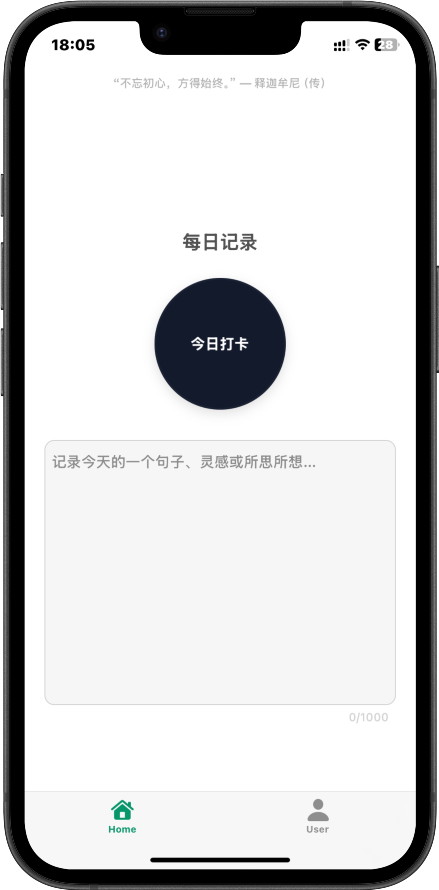
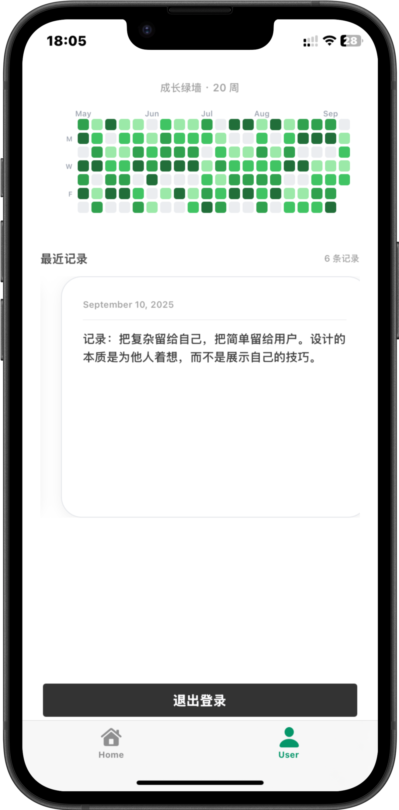
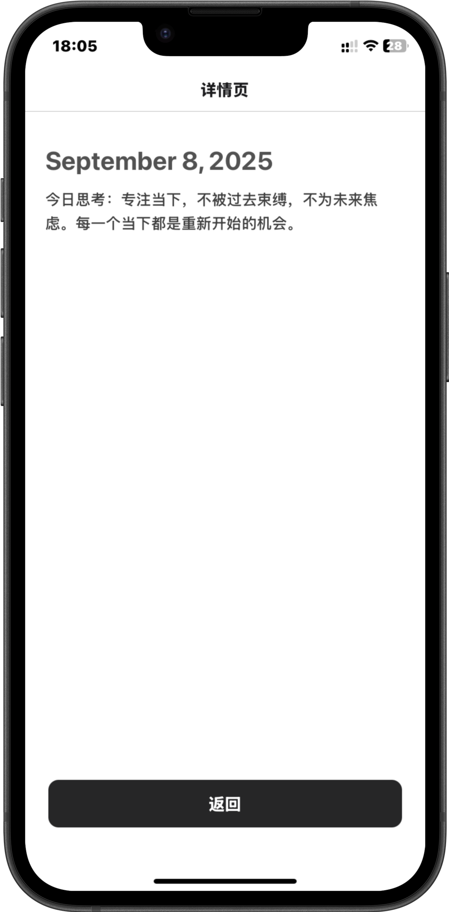

# BigTree

[](https://expo.dev) [](https://reactjs.org) [](https://reactnative.dev) [](https://www.typescriptlang.org) [](LICENSE)

一个用 Expo 构建的跨端 App（iOS/Android/Web），帮助你用极简方式进行「每日记录」与成长打卡。通过轻交互、可视化成长墙，让进步可见。

---

## 预览

<p align="center">
  
  
  
  
</p>

## 功能速览

- **登录**：手机号 + 验证码。
- **首页 · 每日记录**：
  - 动效圆形按钮打卡（轻反馈、呼吸动效）。
  - 文本输入支持自动保存指示（保存中/已保存）。
  - 随机名言鼓励。
- **用户页**：
  - 「成长墙」按周可视化坚持。
  - 「最近记录」横向卡片轮播。
  - 退出登录。
- **详情页**：查看某条记录的日期与内容。
- **体验优化**：深浅色主题、Safe Area 适配、细节动效、触感反馈。

## 项目结构

仅展示与业务最相关的部分：

```
app/
  _layout.tsx                 # 根路由与鉴权导航
  (app)/
    _layout.tsx               # 应用分组（登录后）
    (tabs)/
      _layout.tsx             # 底部 Tab 配置（Home / User）
      index.tsx               # 首页：打卡 + 自动保存 + 文本输入
      tab-two.tsx             # 用户页：成长墙 + 最近记录 + 退出
    detail.tsx                # 记录详情页
components/
  GrowthWall.tsx              # 成长墙（按周）
  HorizontalCarousel.tsx      # 横向轮播容器
  HorizontalNoteCard.tsx      # 最近记录卡片（跳转详情）
  ui/                         # 基于 Gluestack 的 UI 组件封装
contexts/
  AuthContext.tsx             # 简易鉴权（AsyncStorage 持久化）
constants/
  quotes.ts                   # 名人名言随机展示
hooks/
  useBigTreeAnimation.ts      # 登录页品牌动效
  useColorScheme.ts           # 主题 hook
```

## 技术栈

- **路由**：`expo-router`
- **UI/样式**：`gluestack-ui` + `nativewind` + Tailwind CSS
- **动画**：`react-native-reanimated` + 轻量交互动效
- **状态与持久化**：`React Context` + `AsyncStorage`
- **导航与底部栏**：`react-navigation`
- **平台**：Expo、iOS/Android/Web

## 关键实现

- **认证流与路由守卫**：
  - 在 `app/_layout.tsx` 中通过 `useAuth()` 与 `useSegments()` 判断是否在 `(app)` 组内，自动重定向到 `login` 或首页 `/`。
  - 启动时读取 `AsyncStorage` 判断会话；登录/登出时写入/清除本地存储。
- **首页自动保存指示**：
  - 输入时展示「保存中」动画；1 秒无操作即视为已保存并淡出提示。
- **用户页可视化进度与历史**：
  - `GrowthWall` 渲染多周打卡格子。
  - `HorizontalCarousel` 按卡片宽度吸附滚动，`HorizontalNoteCard` 支持跳转详情页并传参。

## 配置与约定

- `app.json`：已配置 `scheme: englishtree`、Splash、Web 输出（`web.output: static`）。
- 主题：跟随系统（`userInterfaceStyle: automatic`），同时在 `StatusBar` 做了适配。
- 类型路由：`experiments.typedRoutes: true`。
- 代码风格：TypeScript、函数式/早返回、明确命名；样式使用 Tailwind Utilities。

## 路线图（Roadmap）

- 云端同步，支持Web端
- Web端运营管理平台
- 基于用户英语笔记，AI扩展整理知识点，辅助记忆、测试、复习
  
## 许可证

本项目采用 [MIT 许可证](LICENSE)。

# TODO

- 接入后端NestJS API
